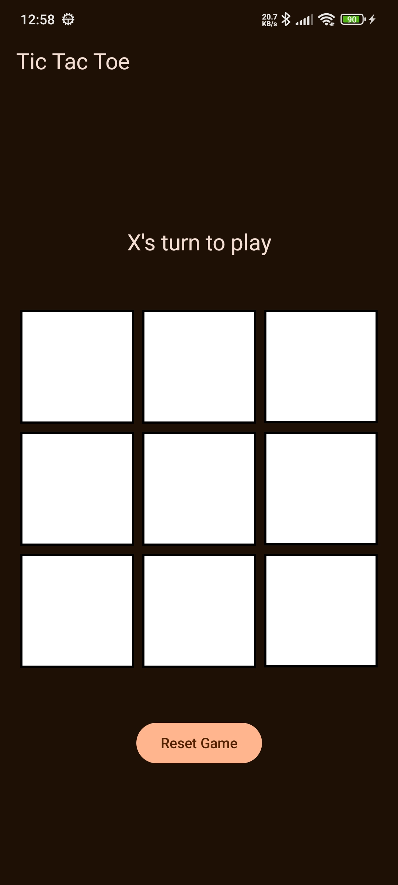
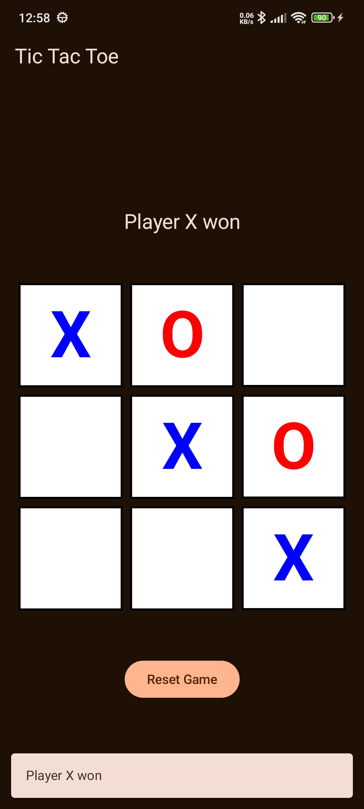
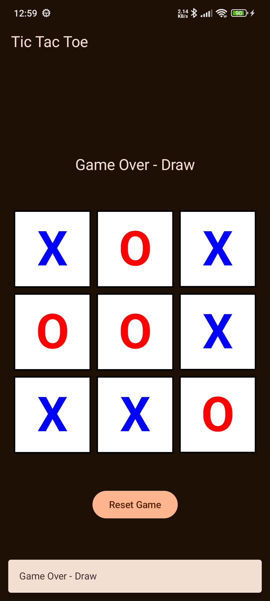

# Tic Tac Toe
A Tic Tac Toe game built using Jetpack Compose, following Clean Architecture, MVVM and TDD.

**Game Rules**
- X always goes first.
- Players cannot play on a played position.
- Players alternate placing X’s and O’s on the board until either:
	- One player has three in a row, horizontally, vertically or diagonally
	- All nine squares are filled.
- If a player is able to draw three X’s or three O’s in a row, that player wins.
- If all nine squares are filled and neither player has three in a row, the game is a draw.

## Architecture
- Presentation - ViewModel + JetPack Compose
- Domain - Use Case + Models

## Tech Stack
- MVVM, Clean architecture, TDD
- Kotlin
- Jetpack Compose
- Navigation
- Coroutines + Flow + ViewModel
- Hilt - Dependency Injection
- Unit tests - JUnit, MockK, Turbine
- Instrumentation tests - Junit, Compose Test

## How to run
1. Open the latest version of Android Studio.
2. Select "Get from Version Control" on the welcome screen or new project with "Project from Version Control".
3. Clone the project using the repository link below:
```
   https://github.com/2026-AND-DEV/TicTacToe.git
```
4. Wait for the Gradle sync to complete.
5. Click the Run button to launch the app on:
   - An Android Emulator
   - Or a connected physical device

Minimum SDK: API 30

Target SDK: API 36

## Screenshots

| Intial State                                    | Game Win                                          | Game Draw                                          |
|---------------------------------------------------------|-------------------------------------------------------|-------------------------------------------------------|
|  |  |  
